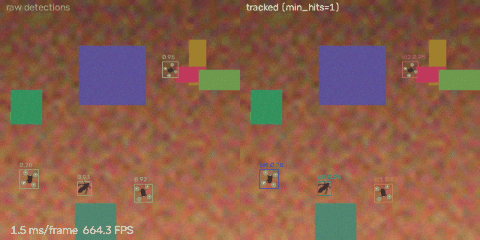
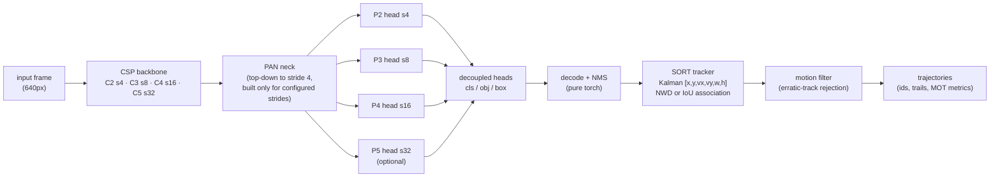

# SkySentry
High-resolution small-object detection and spatiotemporal trajectory tracking pipeline in PyTorch, featuring a P2 stride-4 feature head, Normalized Wasserstein Distance (NWD) loss, and constant-velocity Kalman state estimation.



## Architecture



Every number below is **measured** — the command that produced it is listed in
[Reproduction](#reproduction); results files live in `results/`. Values not yet
measured (full training runs pending hardware) are marked **TBD**.

## Why each piece exists

**P2 (stride-4) head.** Standard YOLO heads start at stride 8; a 6-px bird is
then smaller than one grid cell. The neck here lifts the top-down path to
stride 4, where tiny aerial targets retain 1.5–6 cells of spatial detail.
The head/neck levels are config-toggled (`model.strides`), so the ablation
variants all share one code path.

**NWD loss.** IoU is pathological for tiny boxes: near-identical boxes that
stop overlapping get IoU = 0 and zero gradient. NWD models each box
`(cx, cy, w, h)` as a Gaussian `N(mu, diag((w/2, h/2)^2))` and uses the
closed-form 2-Wasserstein distance

```
W2^2 = (dcx)^2 + (dcy)^2 + ((w1-w2)/2)^2 + ((h1-h2)/2)^2
NWD  = exp(-sqrt(W2^2) / C)          # C ≈ mean object size (12.8 px for VisDrone)
L    = alpha * (1 - NWD) + (1 - alpha) * CIoU
```

smooth, bounded in (0, 1], differentiable everywhere — full derivation in
`losses/nwd_loss.py`, properties under test in `tests/test_nwd_loss.py`.

**Kalman tracking.** Constant-velocity filter on state `[x, y, vx, vy, w, h]`
with Hungarian association. For tiny targets the association metric is
**NWD** (not IoU): a 3-px frame-to-frame jump destroys IoU on a 6-px bird
while barely moving NWD. Tracks coast through up to `max_age` missed frames.

**Sim-to-real.** Training data is the seeded synthetic composer (procedural
quad-rotor/bird sprites, 8–32 px, lighting/glare); real VisDrone splits
measure transfer. Domain augmentation (variant d) targets the gap.

## Detection results — ablation grid

**Status: pipeline verified with a smoke run; full runs are TBD (pending
GPU — see [Limitations](#limitations)).** The numbers below are from the
smoke config (32 train images, 320 px, 6 epochs) — they prove the pipeline,
they do NOT rank the variants.

| experiment | strides | box loss | synthetic-val mAP50 | real-test mAP50 (class-agnostic) |
|---|---|---|---|---|
| a. baseline | 8/16/32 | CIoU | 0.0076 | 0.0010 |
| b. + P2 | 4/8/16 | CIoU | 0.0015 | 0.0015 |
| c. + P2 + NWD | 4/8/16 | 0.5·NWD + 0.5·CIoU | 0.0073 | 0.0008 |
| d. + domain augs | 4/8/16 | 0.5·NWD + 0.5·CIoU | 0.0156 | 0.0003 |

Full-run results: **TBD** (`python run_ablations.py` on CUDA; estimated
40–75 min/experiment, ~3–5 h total).

## Tracking results — occlusion benchmark (measured)

8 synthetic clips (4 objects each, 40 frames), detections artificially
dropped for a contiguous window; scored with `motmetrics`:

| assoc | dropout frames | MOTA | IDF1 | ID switches | ID preservation |
|---|---|---|---|---|---|
| NWD | 0 | 0.959 | 0.980 | 0 | 1.00 |
| NWD | 5 | 0.950 | 0.976 | 0 | 1.00 |
| NWD | 10 | 0.930 | 0.967 | 0 | 1.00 |
| NWD | 15 | 0.923 | 0.964 | 0 | 1.00 |
| IoU | 0 | 0.959 | 0.980 | 0 | 1.00 |
| IoU | 5 | 0.950 | 0.976 | 0 | 1.00 |
| IoU | 10 | 0.930 | 0.967 | 0 | 1.00 |
| IoU | 15 | 0.923 | 0.964 | 0 | 1.00 |

*(Honest note: on this slow-motion synthetic data NWD and IoU tie — the
constant ±3 px/frame drift keeps IoU above its threshold even through 15-frame
dropouts. The sweep is parameterized; faster motion is untested yet.)*

**Motion-based false-positive rejection** (2 injected erratic tracks/clip):

| precision before | precision after |
|---|---|
| 0.438 | 0.532 |

**Throughput** (CPU, full detect→track step, GT-sim): 757 FPS demo pipeline;
tracker alone 0.8–2.5 ms/frame depending on association metric.

## Reproduction

```powershell
pip install -r requirements.txt          # torchvision optional (see note in requirements)
pytest tests/                            # 46 tests
python train_step_dryrun.py              # full-stack smoke check
python -m data.dataset_downloader --dataset synthetic --out data/raw --num-train 2000 --num-val 200
python -m data.dataset_downloader --dataset visdrone --out data/raw --zip data/raw/VisDrone2019-DET-val.zip
python demo.py --gt-sim                  # side-by-side demo (mp4 + gif + report)
python -m tracking.benchmark_occlusion --clips 8
python run_ablations.py --smoke          # pipeline proof (measured, labeled 'smoke')
# full runs (CUDA):
python run_ablations.py
```

## Limitations (honest)

- **Full training has not run yet** (CPU-only box; multi-day per experiment).
  Detection numbers above are smoke-level. Tracking numbers are real but on
  synthetic slow-motion data only.
- Training data is 100% synthetic so far; the real VisDrone split is used for
  **evaluation only**, class-agnostically (VisDrone DET has no drone/bird
  categories — the UAV is the camera). Drone-vs-Bird, which matches our class
  space, requires manual registration (Kaggle) and is not integrated.
- NWD-vs-IoU association shows no difference at slow synthetic speeds.
- The motion filter's first operating point removes 40% of false tracks but
  sacrifices 12% of true ones — thresholds need tuning per deployment.
- Real-video tracking quality is untested (needs the trained checkpoint).

## Roadmap

- **Phase 1 (foundation)** — architecture, losses, tracking, metrics, dry run. ✅
- **Phase 2 (data)** — synthetic composer, VisDrone splits, dataset card, QC grids. ✅
- **Phase 3 (training & ablations)** — train/infer/ablation machinery, 4-variant grid. ✅ (full runs TBD)
- **Phase 4 (tracking)** — video pipeline, occlusion benchmark, FP rejection, NWD-vs-IoU. ✅
- **Phase 5 (demo & portfolio)** — demo, README, resume bullets. ✅ (detection numbers TBD)
